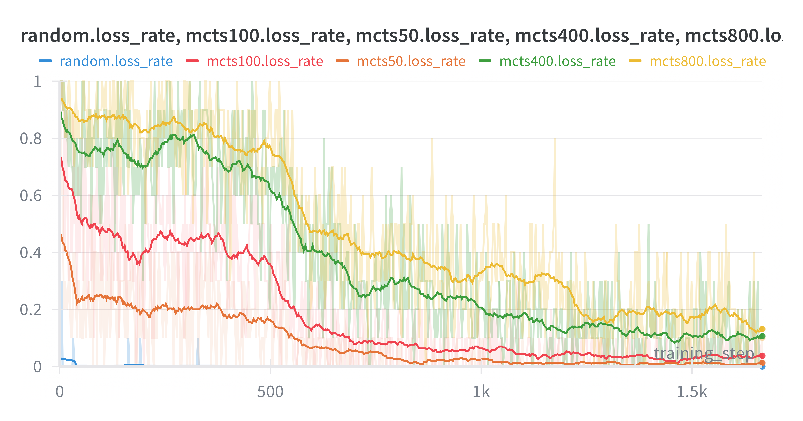

# MCTS Playground

This repository grew out of my desire to understand AlphaZero in detail. I created it having limited exposure to RL, although I have since filled in many of the gaps in my knowledge. The code is designed for conceptual clarity over performance, using PyTorch for deep learning, although it does implement a parallelized actor-learner architecture for training. It may be helpful to someone studying MCTS and AlphaZero, but in terms of performance it cannot compete with libraries that simulate the environment on the GPU or TPU using JAX or similar libraries.

The name `MCTS Playground` is intended to invoke the idea of playing around with variants of MCTS and its derivatives. The modular design of the algorithm implementations emphasizes that several algorithms, including "vanilla" MCTS as well as AlphaZero, can be viewed as instances of an "abstract" MCTS containing a few basic key components. I have since come to think that this may not be the "right" perspective, but it may still be pedagogically useful. The [docs](./docs/algorithms_overview.md) contain a concise overview of MCTS and AlphaZero from this perspective, which may be one of the most useful artifacts from the project. In particular, the docs cover implementation details that are usually skimmed over in expository articles. 

## Overview

`mcts_playground` is the heart of the repository, containing all the algorithms, games, and training tools. More information can be found in the [code overview](./mcts_playground/README.md).

`docs` contains [a concise overview](./docs/algorithms_overview.md) of the main algorithms, including MCTS and AlphaZero.

`experiments` contains several experiments using the core functionality, including full AlphaZero training pipelines.

## Getting started

There is a convenient script for setting upthe project using `uv`:

```bash
bash install.sh
```

## Example: Connect 4

To train a new model for Connect 4 via self play, with logging to Weights & Biases:

```bash
uv run python -m experiments.connect4.train --name="My training run" --wandb --num_actors=10
```

The `num_actors` flag is the number of data generating actors to run in parallel. Note that evaluation also runs in its own process. For additional flags go to [the source](./experiments/connect4/train.py).

Here is an example plot of loss rates vs players using MCTS with different numbers of rollouts:



See [Connect 4](./experiments/connect4/README.md) for more details.