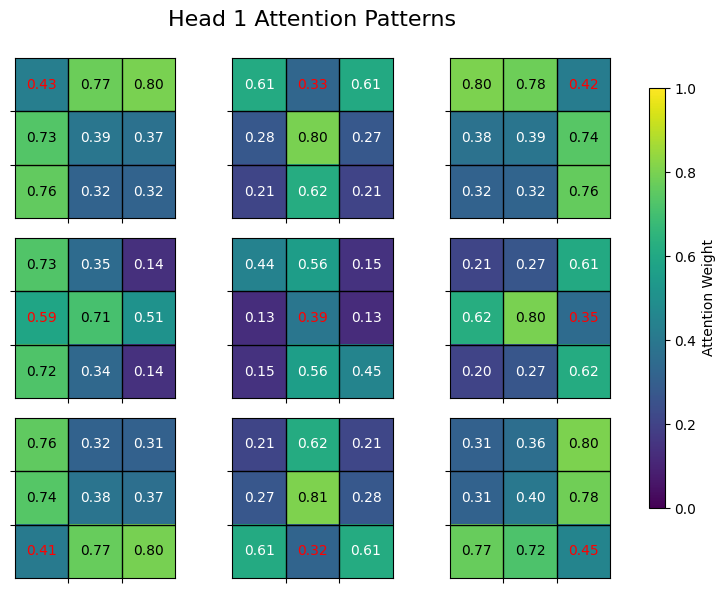

#todo

- [ ] Make TreeSearch and TreeSearchTrainer work with batched operations for parallelizability. Can try to make TreeSearch more integrated with pytorch, to all for playing multiple games in parallel using a sort of queue.
- [ ] Change methods of TensorMapping to use batched operations.Some implementations are surprisingly slow.

# Examples

## Tic tac toe

To play run the following command in the root folder:

```zsh
PYTHONPATH=$PYTHONPATH:. python applications/tic_tac_toe/play.py
```

Example training run from root folder:

```zsh
PYTHONPATH=$PYTHONPATH:. python applications/tic_tac_toe/train.py --model transformer --wandb --resume_id 1q109a9s
```

The `--wandb` argument enables logging of various metrics, the model, and replay buffer. The `--resume_id` argument means that training will resume a previous training run (in this case with id `1q109a9s`).

### Interpretability





