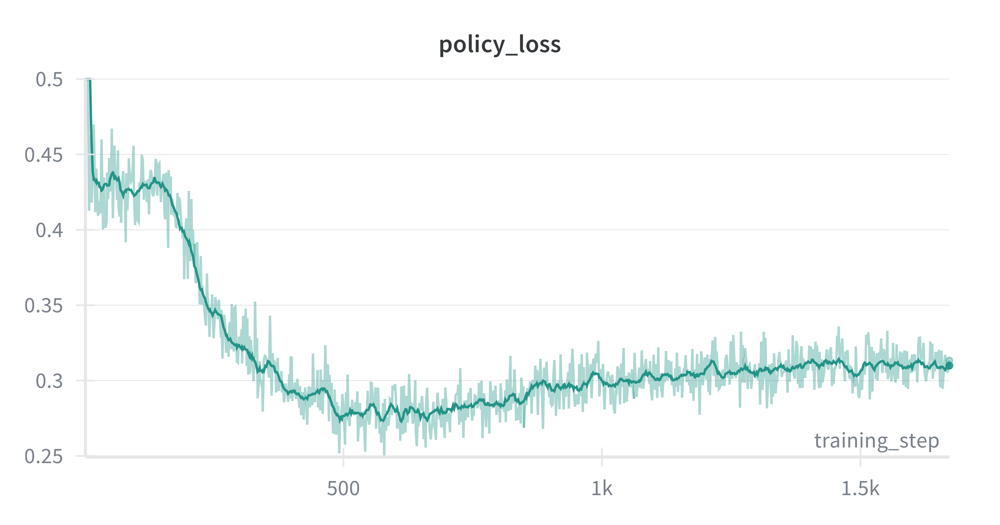
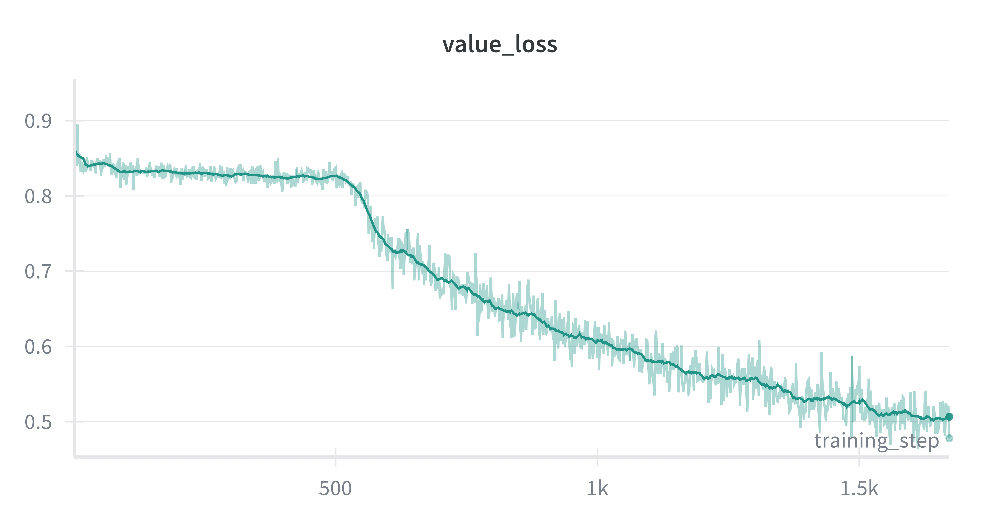
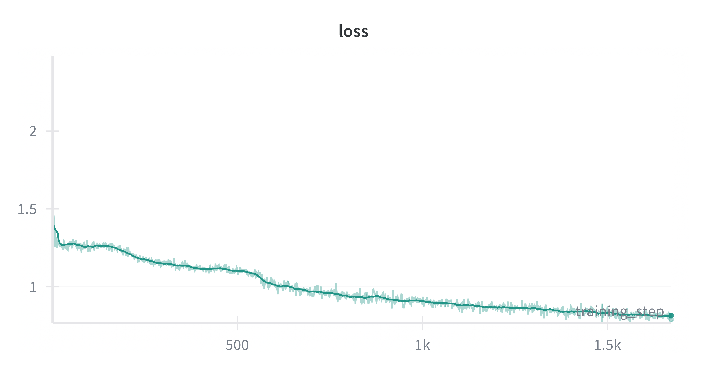
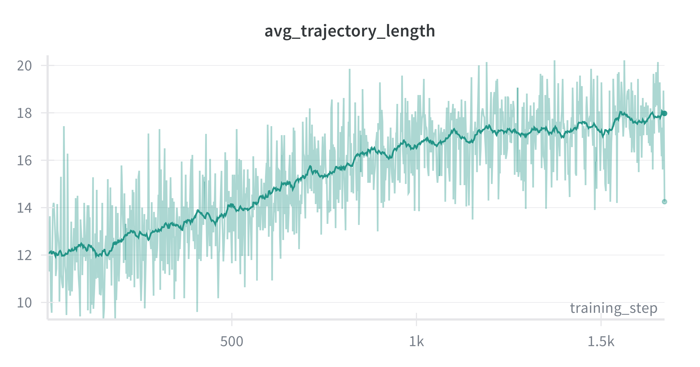

## Overview

- `train.py` contains the main training script.
- `models` contains files for model architectures. 
- `tensor_mapping` contains implementations of `TensorMapping` which manage the logic of translating between game states + actions and tensors

## Getting started

From root folder:

```bash
uv run python -m  experiments.connect4.train --name="Test_run"
```

There are more flags one can pass; see `train.py` for the details. 

## Results

Below are some example plots from running the training script on my laptop. The interplay between policy loss and value loss is particularly interesting. 








