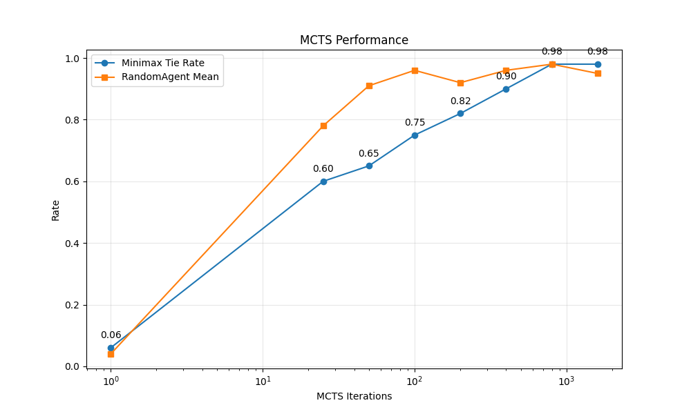

# Experimenting with model architectures in tic-tac-toe

Tic tac toe is a very simple game. For the purpose of doing reinforcement learning experiments, the low complexity of tic tac toe has both pros and cons.

The pros:

- Experiments are quick and can be run on a laptop. This is especially useful for catching bugs in code.
- The game can be solved. This is useful for comparing training with self-play against a supervised learning problem using examples of perfect play.

The cons:

- There are only 5478 possible game states, making overfitting very likely.
- The RL models trained on the game will never be that interesting.

Our tic tac toe experiments are centered around experimenting with different model architectures and training hyperparameters.

# Exploration of different models using supervised learning

We used a minimax model to generate examples of perfect play.

For tic tac toe we have explored a few different classes of models:

1. Standard MLPs
2. Traditional transformers
3. Transformers with masked simple attention
4. Transformers with dynamic masked simple attention

Here's an overview of our findings.

- All models can achieve perfect play.
- The MLPs train quickly, but need orders of magnitude more parameters than some of our other models for comparable performance.
- Traditional transformers do not perform very well.
- Our best performing model is a transformer with masked simple attention, achieving minimal loss and perfect play with ~14k parameters.
- Transformers with dynamic masked simple attention. The smolgen-like mask, which depends on the input state, adds extra parameters, and it's difficult to prevent the model from overfitting. even with only around ~20k parameters.

### Interpretability of the

