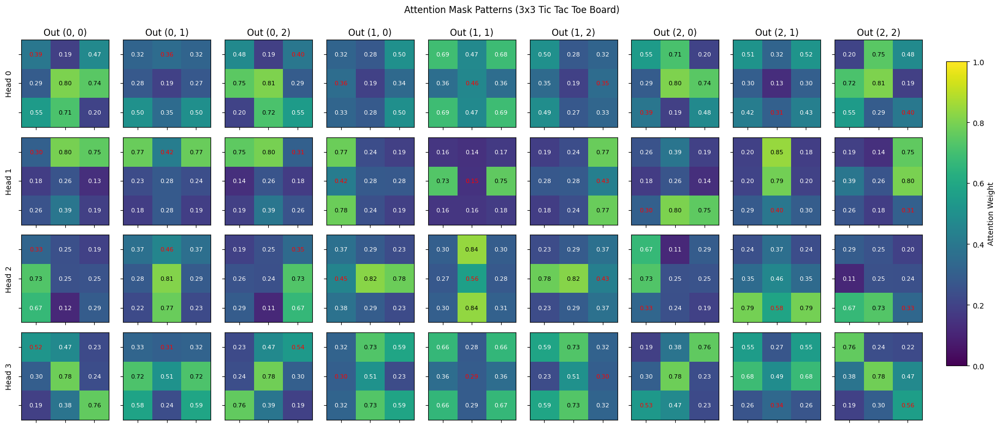
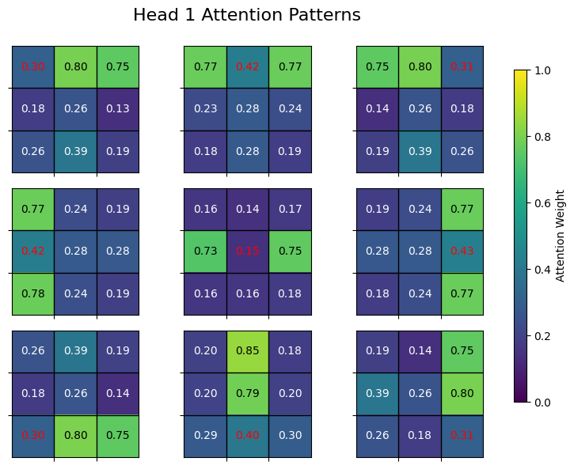
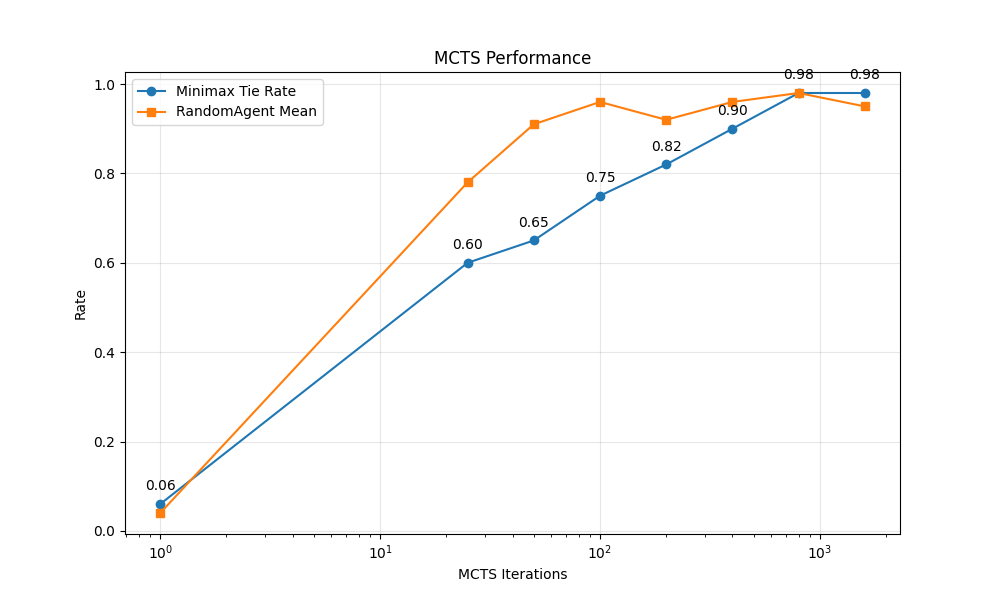

# Experimenting with model architectures in tic-tac-toe

Tic tac toe is a very simple game. For the purpose of doing reinforcement learning experiments, the low complexity of tic tac toe has both pros and cons.

The pros:

- Experiments are quick and can be run on a laptop. This is especially useful for catching bugs in code.
- The game can be solved. This is useful for comparing training with self-play against a supervised learning problem using examples of perfect play.

The cons:

- There are only 5478 possible game states, making overfitting very likely.
- The RL models trained on the game will never be that interesting.

Our tic tac toe experiments are centered around experimenting with different model architectures and training hyperparameters.

# Exploration of different models using supervised learning

We used a minimax model to generate examples of perfect play. This can be used as training/test data for supervised learning experiments with different model architectures. Here are some we tried:

1. Standard MLPs
2. Variant of standard MLP with residual connection ("ResMLP")
3. Traditional transformers
4. Experimental transformer architecture with masked simple attention

A short overview of our findings:

- All models can achieve perfect play, but some train much faster than others.
- The ResMLP learns fast than the MLP and may be the best model overall.
- Traditional transformers seem to need a lot more parameters than other models.
- A transformer with masked simple attention achieves minimal loss and perfect play with ~14k parameters.

### Interpretability

Here are some images of attention masks for transformer with masked simple attention:

